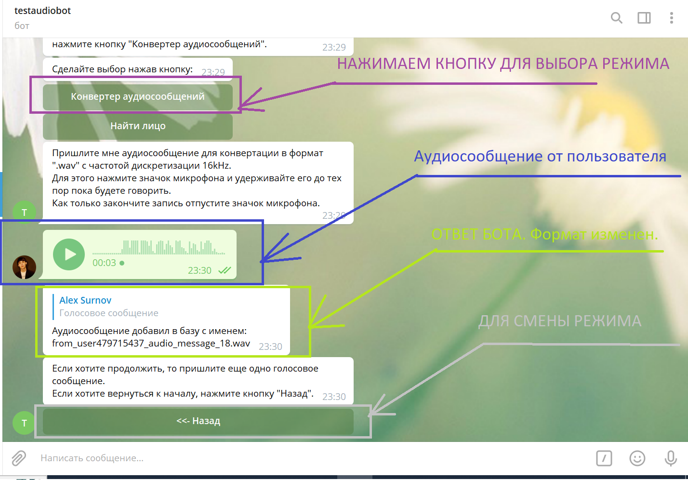
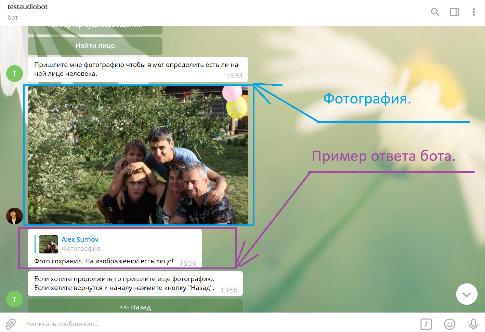

# botaudio
Простой тестовый telegram бот для DSP Labs. 
Робот может:
1. Изменять аудиосообщения от пользователя в формат ".wav" с частотой дискретизации 16кГц. В этом же формате аудиосообщение записывается в БД и на диск. 
2. Распознавать лица на фотографиях. Изображения на которых обнаруженны лица сохраняются на диск.

## Поддержка
1. Python3.8 и выше.

## Конфигурация и запуск:
- получить token бота в telegram от @BotFather
- заполнить файл `/config/config.json` следющим образом:
    - **MANAGERID**: ваш id в сети telegram.
    - **TOKENBOT**: token бота в telegram.
- Перед запуском программы установите зависимости командой в консоли `pip install -r requirements.txt`
- ВАЖНО: для правильной работы бота необходимо отдельно поставить **ffmpeg**. Он необходим для корректного пуска pydub.
    - **Linux Ubuntu**: `apt-get install ffmpeg libavcodec-extra`
    - **Windows**: просто скачайте ffmpeg lib, распакуйте и добавьте `\ffmpeg\bin(В папке 3 файла ffmpeg.exe, ffplay.exe, ffprobe.exe)` в папку вашего проекта. 
    - Обязательно проверьте пути! Подробнее о установке на все ОС читайте здесь https://github.com/jiaaro/pydub
- запустите бота командой `python3.8 botaudio.py`
- для запуска в фоне на ОС Linux Ubuntu воспользуйтесь командой `nohup python3.8 botaudio.py &`

## Пример работы
Работа с голосовыми сообщениями от пользователей.

Работа с фотографиями на которых бот нашел лицо.

Работа с фотографиями на которых бот не нашел лица.

## Модули
1. `DBmodul/dbbot.py` содержит класс для работы с БД SQLite3. 
2. `Facefind/facefind.py`содержит класс для распознавания лиц на фотографиях.
3. `Faceaudiobot/faceaudiobot.py` содержит класс бота. В нем находятся методы для работы с БД и пользователями.
4. Папка `model` содержит каскады для распознавания лиц в формате ".xml"
5. Папка `temporaryfile` для временного сохранения файлов перед их обработкой.
6. Папка `fileaudio` для сохранения преобразованных в формат ".wav" аудиосообщений от пользователей. Файлы также записываются в БД.
7. Папка `fileimageface` для сохранения фотографий на которых бот нашел лица. Сохранение в БД не дублируется.
8. `Image_for_test.zip` архив с изображениями на которых я тестировал распознавание лиц. Можете его использовать :-)

